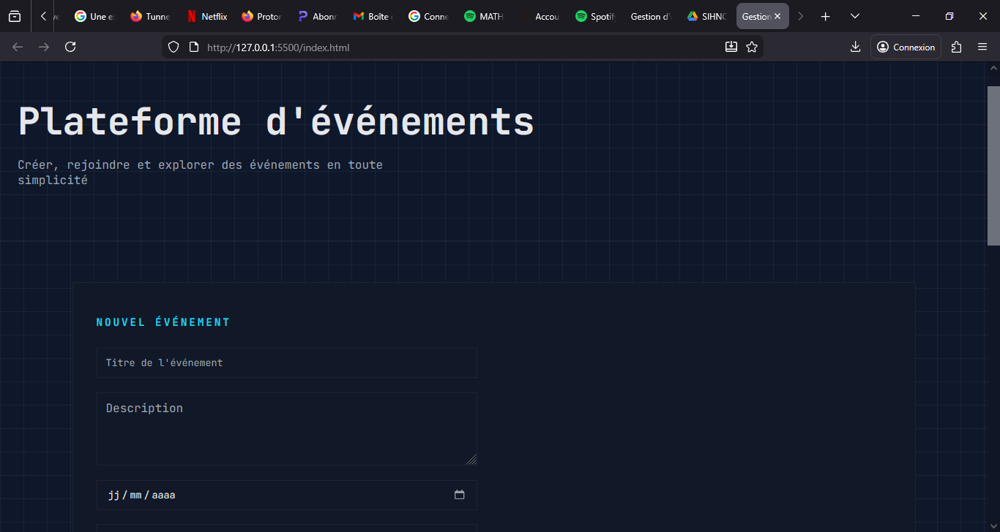
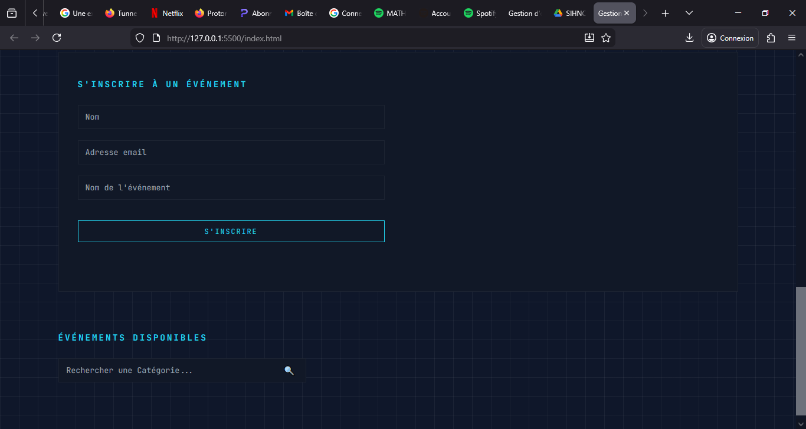

# 📅 Application Web de Gestion d'Événements

## 1. Présentation du projet

Application web développée en **TypeScript** permettant de créer, gérer et consulter des événements institutionnels. Les utilisateurs peuvent créer des événements avec toutes les informations nécessaires (titre, description, date, lieu, catégorie, capacité) et s'y inscrire en utilisant leur email institutionnel (@saintjeaningenieur.org).

Le projet met en pratique la **programmation orientée objet**, l'organisation modulaire du code, et la gestion de données via des tableaux structurés, sans utilisation de frameworks externes ni de base de données.

---

## 2. Fonctionnalités développées

| Fonctionnalité | Statut |
|----------------|--------|
| Création d'événements | ✅ OK |
| Affichage de la liste complète | ✅ OK |
| Filtre par catégorie (recherche) | ✅ OK |
| Page détail d'un événement | ✅ OK (intégré dans les cartes) |
| Inscription d'un utilisateur | ✅ OK |
| Vérification des doublons | ✅ OK |
| Gestion capacité & places restantes | ✅ OK |
| Validation email institutionnel | ✅ OK |
| Gestion statut événement (En cours/Terminé) | ✅ OK |
| Interface moderne et responsive | ✅ OK |

---

## 3. Structure du projet

```
event-app/
│── index.html                    → Page principale de l'application
│── styles/
│   └── main.css                  → Styles complets (design moderne)
│── dist/                         → Fichiers JavaScript compilés
│   └── main.js
│── src/
│   ├── models/                   → Classes métier
│   │   ├── Evenement.ts          → Classe Événement
│   │   ├── Utilisateur.ts        → Classe Utilisateur
│   │   └── Inscription.ts        → Classe Inscription
│   ├── services/                 → Logique métier
│   │   ├── GestionEvenement.ts   → Gestion des événements
│   │   ├── GestionUtilisateurs.ts → Gestion des utilisateurs
│   │   ├── GestionInscriptions.ts → Gestion des inscriptions
│   │   └── Fonctions.ts          → Fonctions principales
│   └── main.ts                   → Point d'entrée de l'application
│── tsconfig.json                 → Configuration TypeScript
│── package.json                  → Gestion du projet
│── .gitignore                    → Exclusion des fichiers inutiles
└── README.md                     → Documentation (ce fichier)
```

### 📂 Organisation du code

- **models/** : Contient les classes représentant les entités (Événement, Utilisateur, Inscription)
- **services/** : Contient la logique métier et les gestionnaires de données
- **main.ts** : Gère l'interface utilisateur et les interactions

---

## 4. Installation & lancement

### Prérequis
- Node.js installé
- npm (gestionnaire de paquets)

### Étapes

**1) Cloner le projet**
```bash
git clone [URL_DE_VOTRE_DEPOT]
cd event-app
```

**2) Installer les dépendances**
```bash
npm install
```

**3) Compiler le TypeScript**
```bash
npm run build
```

**4) Lancer l'application**

Ouvrez le fichier `index.html` dans votre navigateur, ou utilisez **Live Server** dans VS Code pour un rechargement automatique.

---

## 5. Mode d'utilisation de l'application

### 🎯 Créer un événement

1. Remplissez le formulaire **"Nouvel événement"** avec :
   - Titre de l'événement
   - Description complète
   - Date de l'événement
   - Lieu
   - Catégorie (ex: conférence, sport, atelier)
   - Nombre maximum de places

2. Cliquez sur **"Enregistrer"**

3. L'événement apparaît automatiquement dans la liste en bas de page

### 🔍 Rechercher un événement

Utilisez la barre de recherche pour filtrer les événements par **catégorie**. Tapez le nom d'une catégorie et les résultats s'affichent en temps réel.

### ✍️ S'inscrire à un événement

1. Dans le formulaire **"S'inscrire à un événement"**, renseignez :
   - Votre nom
   - Votre email institutionnel (@saintjeaningenieur.org)
   - Le nom exact de l'événement

2. Cliquez sur **"S'inscrire"**

### ⚠️ Restrictions automatiques

- **Email invalide** : Seuls les emails @saintjeaningenieur.org sont acceptés
- **Événement complet** : Impossible de s'inscrire si toutes les places sont prises
- **Événement terminé** : Impossible de s'inscrire à un événement passé
- **Inscription double** : Un utilisateur ne peut pas s'inscrire deux fois au même événement
- **Événement inexistant** : Vérification du titre de l'événement

### 📊 Affichage des informations

Chaque carte d'événement affiche :
- Le titre et la catégorie
- La description
- La date de l'événement
- Le lieu
- Le nombre de places disponibles
- Le statut (En cours / Terminé)

---

## 6. Captures d'écran

### 📱 Page d'accueil

*Interface principale avec formulaires de création et d'inscription*

### 🎫 Liste des événements

*Affichage des événements avec toutes les informations*

### 🔎 Recherche par catégorie

*Filtrage dynamique des événements*

### ✅ Inscription réussie

*Message de confirmation d'inscription*

---

## 7. Conclusion & limites

### ✅ Points forts
- Architecture modulaire claire et maintenable
- Validation complète des inscriptions
- Interface moderne et responsive
- Gestion automatique des statuts d'événements
- Recherche en temps réel

### 🔨 Difficultés rencontrées
- Gestion des doublons d'inscription avec vérification croisée
- Synchronisation entre les différentes listes (événements, utilisateurs, inscriptions)
- Gestion dynamique du nombre de places restantes

### 🚀 Améliorations futures
- Persistance des données avec localStorage
- Page de détail séparée pour chaque événement
- Édition et suppression d'événements
- Filtres multiples (date, lieu, catégorie)
- Notifications par email
- Export de la liste des participants
- Gestion des rôles (administrateur/utilisateur)
- Ajout d'images pour les événements

---

## 8. Informations auteur

| Champ | Information |
|-------|-------------|
| **Nom & Prénom** | [Votre Nom] |
| **Matricule** | [Votre Matricule] |
| **Email** | [votre.email@saintjeaningenieur.org] |
| **Niveau** | Licence 2 - TypeScript |
| **Année académique** | 2025-2026 |

---

## 📚 Technologies utilisées

- **TypeScript** (langage principal)
- **HTML5** (structure)
- **CSS3** (design moderne avec grille et variables CSS)
- **JavaScript** (compilation TypeScript)

---

## 📝 Licence

Projet académique - Année 2025-2026 - Tous droits réservés

---

*"L'école ce n'est pas le piège, ensemble luttons contre le travail de la dernière minute"*